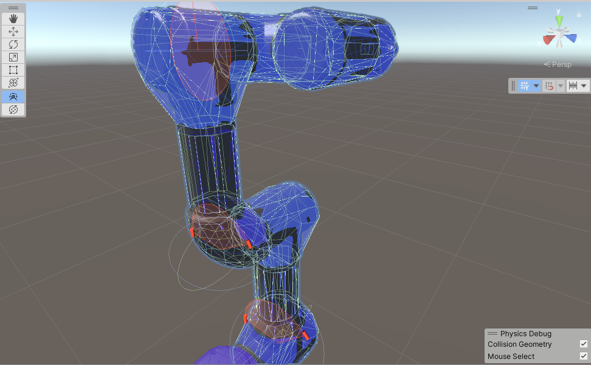
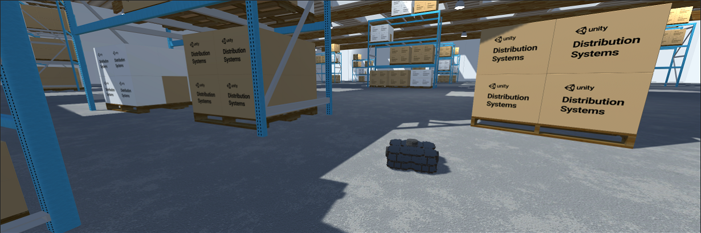
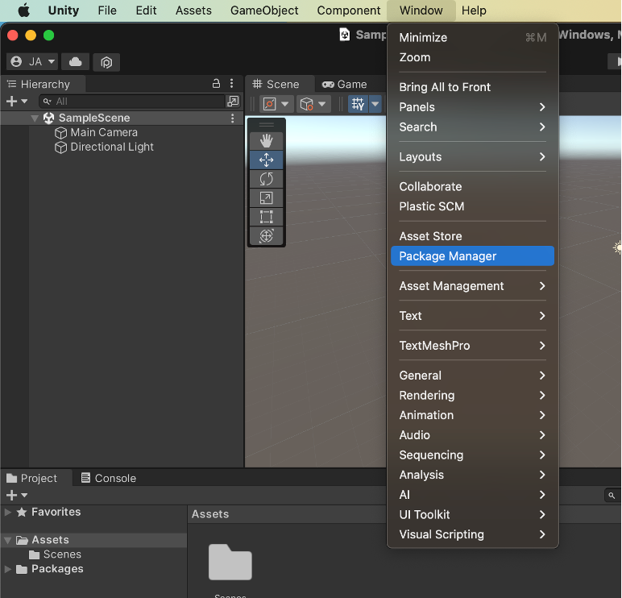
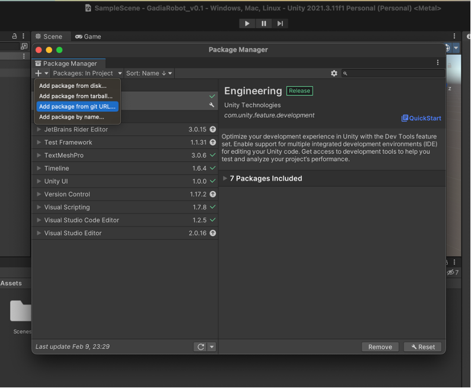
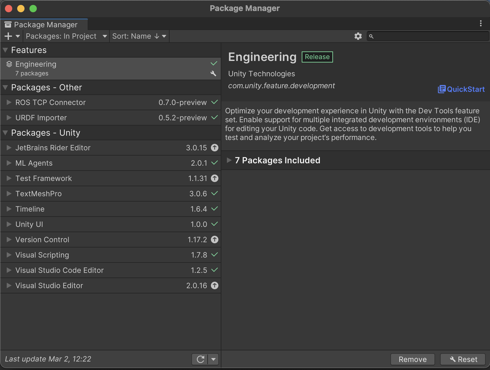
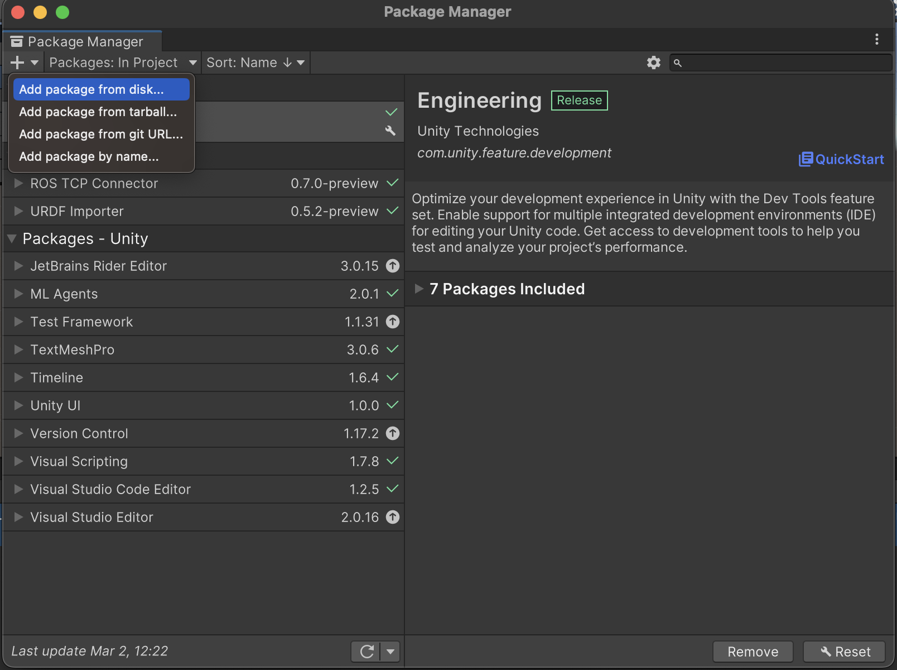
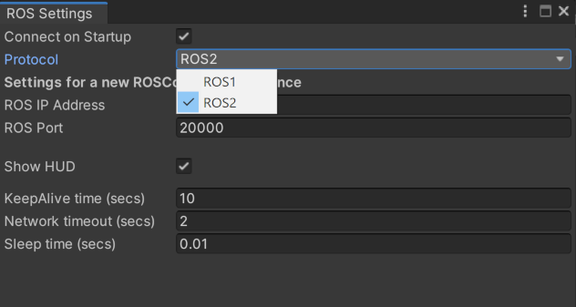

# NiryoRobotROS2Unity## ROS 2 Drives Modern Robotics Hand in Hand with UNITY

Modern robotics is shifting its focus towards "autonomy." The study and development of algorithms capable of making decisions in the absence of strictly defined rules by a human developer. Simulation supports this transition by allowing greater flexibility and faster experimentation. Many of the new use cases for ROS 2 focus on autonomy.
It means that the decisions a robot makes and the outcomes of those decisions are not clearly predictable. Compared to industrial robots, the operating environment of an autonomous robot is exponentially larger. To fully validate that an autonomous robot behaves as expected, a sufficiently robust simulation can be conducted.




With Unity's Robotics packages, accessing communication interfaces with ROS or ROS 2 will be easy. Import existing robot configurations directly from URDF files with the URDF Importer. Simulate a robot within Unity's high-quality and efficient rendering pipeline. Through the Unity Asset Store, you have access to a wide variety of pre-built environments and additional accessories that will help you model your robot's specific environment and tasks.




## Installation of Unity Hub on Ubuntu

The first step is to download the Unity program for Ubuntu.
Step 1: Add the Unity3D repository:
```sh
sudo sh -c 'echo "deb https://hub.unity3d.com/linux/repos/deb stable main" > /etc/apt/sources.list.d/unityhub.list'
```
Step 2: Add the public signing key:
```sh
wget -qO - https://hub.unity3d.com/linux/keys/public | sudo tee /etc/apt/trusted.gpg.d/unityhub.asc
```
Step 3: Install Unity Hub:
```sh
sudo apt update
sudo apt install unityhub
```
Step 4: If you want to remove Unity Hub:
```sh
sudo apt remove unityhub
```

## Installation of Unity Robotics Packages

Step 1: Window -> Package Manager




Step 2: In the Package Manager window, search for and click the + button located in the upper left corner of the window. Select Add package from git URL....




Step 3: Enter the git URL of the desired package. Note: you can add a version tag at the end of the git URL, such as #v0.4.0 or #v0.5.0, to specify a particular version of the package, or exclude the tag to get the latest from the main branch of the package.
For ROS-TCP-Connector, enter:
```plaintext
https://github.com/Unity-Technologies/ROS-TCP-Connector.git?path=/com.unity.robotics.ros-tcp-connector
```

For URDF-Importer, enter:

https://github.com/Unity-Technologies/URDF-Importer.git?path=/com.unity.robotics.urdf-importer


Note:
If when you try to import the Unity packages for ROS-TCP-Connector and URDF-Importer (Step 2), an error is generated or they simply do not appear in the installed packages in Unity, then you should try importing the ROS-TCP-Connector and URDF-Importer packages from Unity (Step 3).




There is another way to install these packages, the steps are as follows:

Step 1: Download the following package as a .zip: [https://github.com/Unity-Technologies/ROS-TCP-Connector](https://github.com/Unity-Technologies/ROS-TCP-Connector). To download it, click on the *<> Code* button and download it as a .zip file.
Step 2: Unzip the file.
Step 3: Inside the ROS-TCP-Connector folder, look for the following directories:
- com.unity.robotics.ros-tcp-connector
- com.unity.robotics.visualizations
Inside each of these directories, you will find a file named: package.json. To import this package from Unity, we will do the following:

Step 1: Go to Windows ---> Package Manager
Step 2: Click on "+" in the upper left corner:





Step 4: Click on: Add package from disk
Step 5: Browse for the package.json file located within each of the following folders:
- com.unity.robotics.ros-tcp-connector
- com.unity.robotics.visualizations
Then click Open.

## Minimum Communication Requirements:
The minimum configuration needed for Unity to communicate with ROS is to set the ROS_IP on the ROS side in a launch file and on the Unity side in Robotics -> ROS Settings.


 
## ROS-TCP:

- A TCP endpoint running as a ROS node, facilitating message passing to and from Unity and ROS. Messages passed between Unity and ROS are expected to be serialized as ROS would internally serialize them.
- To achieve this, the MessageGeneration plugin (from the ROS TCP Connector repository) can generate C# classes, including serialization and deserialization functions, from ROS .msg files.


The next step is to download the ROS-TCP-Endpoint package, which can be obtained from the following Github link:
[https://github.com/Unity-Technologies/ROS-TCP-Endpoint.git](https://github.com/Unity-Technologies/ROS-TCP-Endpoint.git)

Once downloaded, ensure that you are on the ROS 2 branch. To verify if you are on the correct branch, run the following command from the terminal:
```sh
cd turtlebot3_ws ## Modify turtlebot3_ws with your workspace
cd src/ROS-TCP-Endpoint
git status ## If you encounter an error while using this command, install git with: sudo apt install git
```
The result of running git status will be something like this:
```
On branch main
Your branch is up to date with 'origin/main'.
nothing to commit, working tree clean
```
If you need further assistance or have more text to translate, feel free to ask!

Once we confirm that we are on the main branch, we switch branches with the following command:
```sh
git checkout dev-ros2
```
By default, when cloning from git, the cloned folder is in uppercase and with hyphens. To compile with ROS 2, it's necessary to change the name:
ROS-TCP-Endpoint ---> ros_tcp_endpoint

The next step is to build the ROS 2 workspace:
```sh
colcon build
```

Once Unity is installed, the following [video](https://youtu.be/1aEUl9KX0Ik)  demonstrates how to import the Niryo robot and link it with the ROS 2 robot. The repository for the ROS 2 robot can be found at the following link:


[https://github.com/jarain78/NiryoRobotRosHumble.git]


## Contributions

Contributions to this project are welcome. If you have improvements, fixes, or new features you would like to add, please follow these steps:

1. Fork this repository.
2. Create a new branch (`git checkout -b feature/new-feature`).
3. Make your changes and commit descriptive messages.
4. Submit a detailed pull request explaining your changes.

## Support

If you encounter any issues or have questions about using this repository, please open an issue on GitHub. You can also contact the project maintainers via email at [jarincon@ubu.es](mailto:support@example.com).


